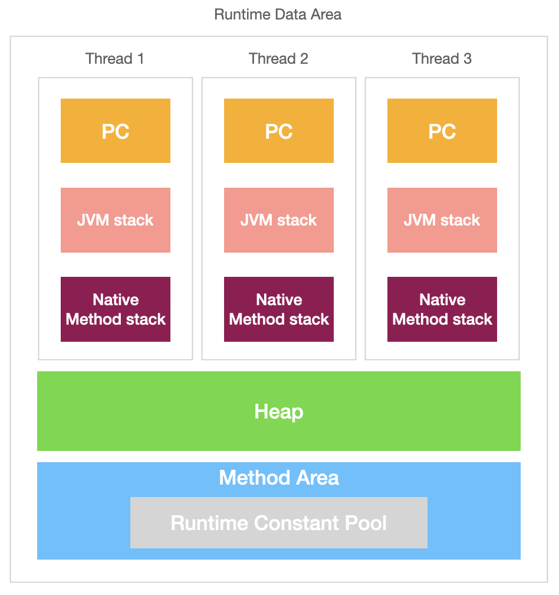
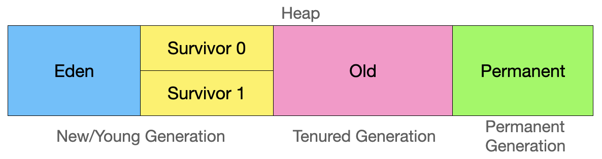

# JVM
- Java Virtual Machine
- 자바 애플리케이션을 클래스 로더를 통해 읽어 자바 API와 함께 실행
- 스택 기반의 가상머신
- 메모리 관리, Garbage Collection

## 자바 프로그램 실행과정
1. OS로부터 JVM이 메모리를 할당 받는다.
2. 자바컴파일러(javac)가 소스코드(.java)를 바이트 코드(.class)로 변환
3. 클래스 로더(Class Loader)가 클래스파일을 JVM으로 로딩
4. 로딩된 클래스 파일들은 Execution engine을 통해 해석
5. 해석된 바이트 코드는 Runtime Data Area에 배치되어 실행

## Class Loader
- JVM내로 클래스를 로드
- 링크를 통해 배치하는 작업
- Runtime 시에 동적으로 클래스를 로드

## Execution Engine
- Class Loader가 런타임 데이터 영역에 배치시킨 바이트 코드를 실행
- 실행방식
    - Interpreter(인터프리터) : 바이트 코드를 명령어 단위로 읽어서 실행, 한줄씩 실행하므로 느리다.
    - JIT(Just-In-Time) : 인터프리터 방식으로 실행하다 적절한 시점에 바이트 코드 전체를 컴파일하여 _네이티브 코드_ 로 변경하여 캐시에 저장

## Runtime Data Area
- 프로그램을 수행하기 위해 OS에서 할당받은 메모리 공간
- 
- PC Register
    - Thread가 시작될 때 생성될 떄 생성
    - 스레드마다 하나씩 존재
    - 현재 실행중인 명령의 주소를 기록
- JVM stack
    - 프로그램 실행시 임시로 할당되었다가 메소드 종료시 소멸되는 특성의 데이터를 저장하는 영역
    - 메소드 호출 시마다 각각의 메소드 스택 프레임 생성되고 메소드 종료시 삭제
    - 각종 형태의 변수나 임시데이터, 스레드, 메소드의 정보를 저장
    - 호출된 메소드의 매개변수, 지역변수, 리터 값 및 연산 시 일어나는 값들을 임시로 저장
- Native method stack
    - Java가 아닌 다른 언어로 작성된 코드를 위한 공간
    - Java native interface를 통해 바이트 코드로 전호나하여 저장
    - 커널이 스택을 잡아 독자적으로 프로그램을 실행시키는 영역

- Method Area(Class Area, Static Area)
    - 클래스가 로드 될때 초기화되는 대상을 저장하는 메모리 영역
    - Runtime Constant Pool : 상수 자료형을 저장하여 참조

- Heap
    - 
    - New/Young
        - Eden : 객체들이 최초로 생성되는 공간
        - Survivor 0,1 : Eden에서 참조되는 개체들이 저장되는 공간
    - Old
        - new/young area에서 일정시간 이상 살아있는 객체들을 저장하는 공간
    - Permanent
        - 생성된 객체들의 정보의 주소값이 저장되는 공간
        - Class Loader에 의해 로드된 class, method 등에 대한 meta 정보가 저장되는 영역, JVM에 의해 사용
        - Reflection을 사용하여 동적으로 클래스가 로딩되는 경우에 사용