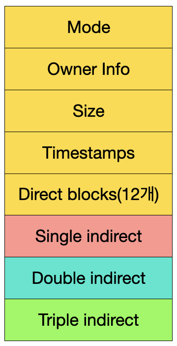

# 파일 시스템
- 운영체제가 저장매체에 파일을 쓰기 위한 자료구조 또는 알고리즘

## 파일 시스템이 만들어진 이유
- 블록
    - 비트 단위로 관리하면 오버헤드가 크다
    - 4kb정도의 블록 단위로 관리
    - 블록마다 고유 번호 부여, 관리
- 파일
    - 사용자가 각 블록 고유 번호 관리 어려움 -> 추상적 객체 필요 -> 파일
    - 사용자가 파일 단위로 관리 -> 파일에는 블록 단위로 관리
- windows : FAT, FAT32, NTFS
    - 블록 위치를 FAT라는 자료구조에 기록
- linux : ext2, ext3, ext4
    - 일종의 인덱스 블록 기법인 inode 방식 사용

## inode 방식 파일 시스템
- 파일 시스템 기본 구조
    - 수퍼 블록 : 파일 시스템 정보
    - 아이노드 블록 : 파일 상세 정보 like PCB
    - 데이터 블록 : 실제 데이터 (1kb ~ 4kb)

## inode와 파일
- 파일 : inode 고유값과 자료구조에 의해 주요 정보 관리
    - *파일이름:inode* 의 형태로 파일이름은 inode 번호와 매칭
    - 파일 시스템에서는 inode를 기반으로 파일 액세스
    - inode 기반 메타 데이터 저장

## inode block 구조
- Direct block : data block을 직접 가리킨다.
- sigle indirect : direct block 포인터 들을 가리킨다.
- double indirect : single indirect 포인터 들을 가리킨다.
- triple indirect : double indirect 포인터 들을 가리킨다.
- 