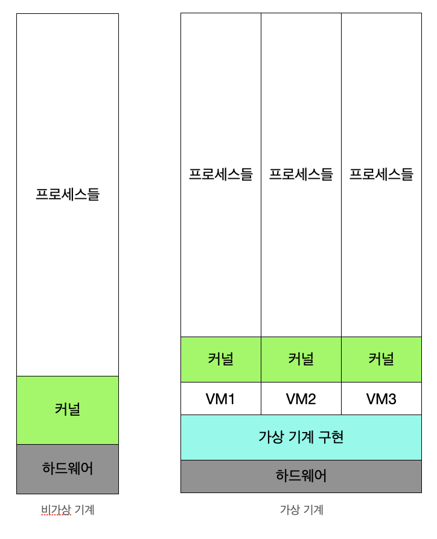

# 가상머신
- Virtual Machine
- 하나의 하드웨어에 다수의 운영체제를 설치하고, 개별 컴퓨터처럼 동작하도록 하는 프로그램
- 

## Virtual Machine Type1 (native, bare metal)
- 하이퍼 바이저(VMM) : 운영체제, 응용프로그램을 물리적 하드웨어에서 분리하는 프로세스
- VMM 소프트웨어가 하드웨어에서 직접 구동
    - ex) Xen, KVM
- 성능이 가장 좋음
- AWS환경도 Bare-Metal 기반 가상 머신 기술 활용(KVM)

## Virtual Machine Type2 (Hosted)
- VMM 소프트웨어가 Host OS 상위에 설치되어 그 위에서 가상 머신 구현
- type1과 다르게 Host OS 위에서 바로 응용프로그램도 실행 가능
    - ex) VMWare, Mac의 Paralles Desktop

## 전가상화, 반가상화
- 전가상화(Full Virtualization)
    - 각 가상머신이 하이퍼바이저를 통해서 하드웨어와 통신
    - 하이퍼바이저가 마치 하드웨어인 것처럼 동작
    - 가상머신의 OS는 자신이 가상 머신 상태라는 것을 모른다
- 반가상화(Half Virtualization)
    - 각 가상머신에 설최되는 OS는 가상 머신인 경우 이를 인지하고 각 명령에 하이퍼바이저 명령을 추가해서 하드웨어와 직접 통신
- 최근에는 HW 성능 개선으로 전가상화 선호

## Docker
- 가상머신은 컴퓨터 하드웨어를 가상화(__*하드웨어 전체 추상화)*__)
    - 하이퍼바이저 사용, 추가 OS 필요 등 성능 저하 이슈 존재
- Docker는 운영체제 레벨에서 별도로 분리된 실행환경을 제공(__*커널 추상화*__)
    - 리눅스를 처음 설치했을 때와 유사한 환경을 만들어주는 리눅스 컨테이너 기술 기반
    - 리눅스 컨테이너 기술이므로 macOS나 windows에 설치할 경우는 가상 머신 기반 제공
    - 경량 이미지로 **실행환경을 통째로 백업, 실행 가능**

## JVM
- JAVA Virtual Machine
- 가상 머신과는 다른 목적 (응용 프로그램 레벨 가상화)
- JAVA 컴파일러는 CPU dependency를 가지지 않는 bytecode를 생성
- 이 파일을 JVM에서 실행
- 각 운영체제를 위한 JVM 프로그램 존재