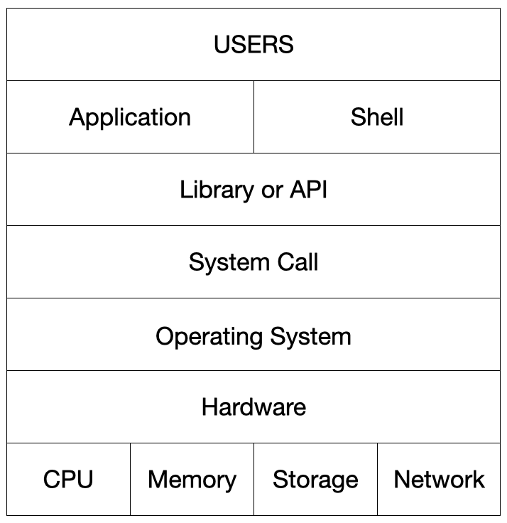

# 운영체제 구조
- 운영체제는 응용프로그램이 요청하는 메모리를 허가하고, 분배한다.
- 운영체제는 응용프로그램이 요청하는 CPU 시간을 제공한다.
- 운영체제는 응용프로그램이 요청하는 IO Devices 사용을 허가/제어 한다.
- 
- 운영체제는 사용자 인터페이스 제공
    - 쉘 : 사용자가 운영체제 기능과 서비스를 조작할 수 있도록 인터페이스를 제공하는 프로그램
- 운영체제는 응용 프로그램을 위한 인터페이스 역시 제공
    - API(Application Programming Interface)
    - Library
## 시스템 콜
- 시스템 콜 또는 시스템 호출 인터페이스
- 운영체제가 운영체제의 각 기능을 사용할 수 있도록 시스템 콜이라는 명령 또는 함수를 제공
- 보통 시스템 콜을 직접 사용하기 보다는 API를 사용, API는 내부에서 시스템 콜 사용

## CPU Protection Rings
- CPU의 권한모드
    - 사용자 모드 (user mode by applications) : 응용 프로그램이 사용
    - 커널 모드 (kernel mode by OS) :  특권 명령어 실행과 원하는 작업 수행을 위한 자원 접근을 가능하게 하는 모드. OS가 사용
- 응용 프로그램이 실행 -> 운영체제 기능이 필요한 API 호출 시 -> 시스템 콜 호출 -> 커널모드로 변경 -> OS 내부에서 해당 명령이 실행 -> 다시 응용 프로그램으로 돌아감