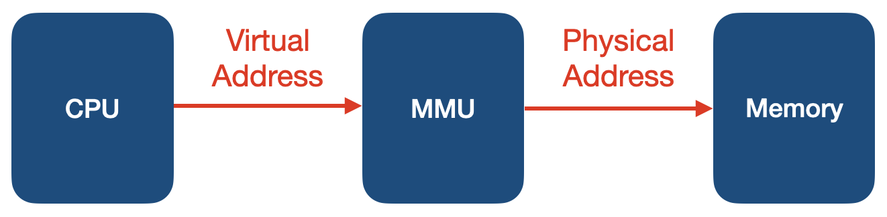

# 가상 메모리
- 실제 각 메모리마다 충분한 메모리를 할당 하기에는 메모리 크기가 한계가 있다.
- 여러 프로세스를 동시 실행하는 시스템에서는 필수적
- 가상 메모리 : 메모리가 실제 메모리보다 많아 보이게 하는 기술
    - 실제 사용하는 메모리는 작다는 점에 착안해서 고안
    - 프로세스간 공간 분리, 프로세스 이슈가 전체 시스템에 영향을 주지 않을 수 있다.
- 기본 아이디어
    - 프로세스는 가상 주소를 사용하고 실제 해당 주소에서 데이터를 읽고 쓸 때만 물리 주소로 바꾸자
- virtual address(가상 주소) : 프로세스가 참고하는 주소
- physical address(물리 주소) : 실제 메모리 주소
- MMU(Memory Management Unit) : CPU에 코드 실행시, 가상 주소 메모리 접근이 필요할 때, 해당 주소를 물리 주소 값을 변환해주는 하드웨어 장치
- __*메인 메모리에는 프로세스의 데이터 조각의 물리 주소들이 올라가 있다.*__
- __*CPU는 가상 메모리를 다루고, 실제 해당 주소 접근시 MMU 하드웨어 장치를 통해 물리 메모리 접근*__
    - 하드웨어 장치를 이용해야 주소 변환이 더 빠르다.

## 페이징 시스템
- 페이징(paging)
    - __*크기가 동일한 페이지*__ 로 가상 주소 공간과 이에 매칭하는 물리 주소 공간을 관리
    - 하드웨어 지원 필요
    - 리눅스에서는 4KB로 paging
    - 페이지 번호를 기반으로 가상주소/물리주소 매핑 정보를 기록 및 사용
    - Page Table에 매핑 정보를 담는다.
    - PCB에는 Page Table 구조체를 가리키는 주소가 있다.
    - Page, Page frame : 고정된 크기의 block(리눅스에서는 4kb)
- page system
    - 가상 주소 v = (p,d)
        - p : 페이지 번호
        - d : 변위, 페이지 처음으로 부터 얼마나 떨어진 위치 인지
    - 프로세스에서 특정 가상 주소에 액세스 동작
        - PCB의 page table 주소 참조
        - 해당 가상 주소의 page 번호 확인
        - 있으면 매핑된 첫 페이지의 물리주소 p'에 d를 더한 값이 실제 물리 주소

## 페이징 시스템과 MMU
- 
- CPU는 가상 주소 접근시 MMU 하드웨어 장치를 통해 물리 메모리에 접근
- 프로세스 생성시 페이지 테이블 정보 생성
    - PCB등에서 해당 페이지 테이블에 접근 가능하고, 관련 정보는 물리 메모리에 적재
    - 프로세스 구동시, 해당 페이지 테이블 base 주소가 별도 레지스터에 저장(CR3)
    - CPU가 가상 주소 접근시, MMU가 페이지 테이블 base 주소에 접근해서 물리 주소를 받아온다.

## MMU와 TLB
- TLB(translation lookaside buffer) : 페이지 정보 캐쉬
- 물리 주소 참조 속도 향상을 위해 MMU와 물리 주소를 전달 및 캐쉬

## 공유 메모리
- 프로세스간 동일한 물리 주소를 가리킬 수 있다.
    - 공간 절약
    - 메모리 할당 시간 절약
- 물리 주소 데이터 변경 시도 시, 물리 주소를 복사한 후에 수정한다.(copy-on- write)

## 세그멘테이션
- 가상 메모리를 __*서로 크기가 다른*__ 논리적 단위인 세그먼트로 분할
- 세그먼트 가상 주소 v = (s,d)
    - s : 세그먼트 번호
    - d : 변위
- 페이지 기법과 세그멘테이션 기법의 문제점
    - 내부 단편화(페이지) : 페이지 블록만큼 데이터가 채워져 있지 않을 경우 공간 낭비
    - 외부 단편화(세그먼트) : 물리 메모리가 원하는 연속된 크기의 메모리를 제공하지 못하는 경우