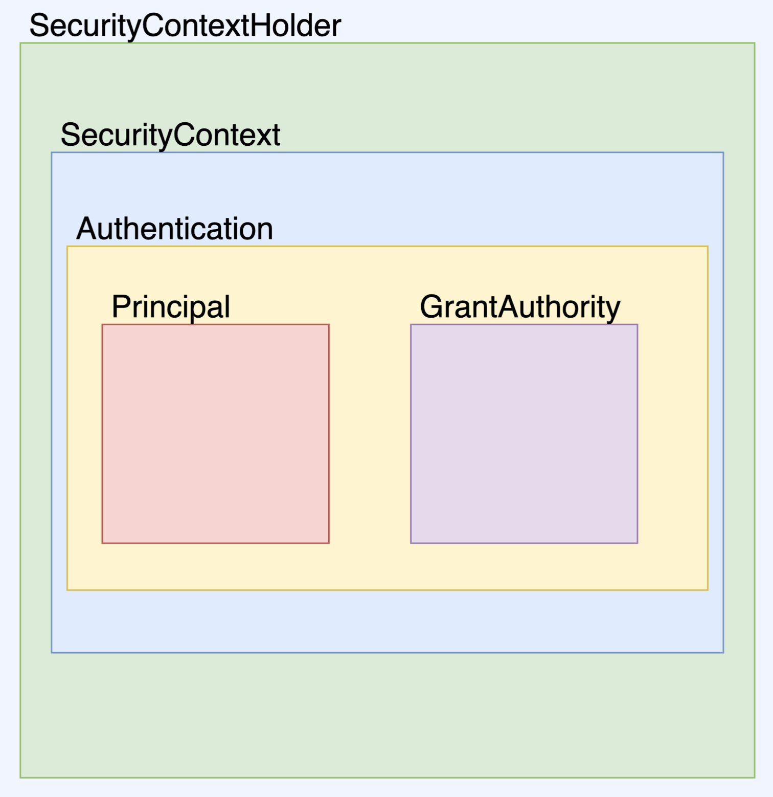

# 스프링 시큐리티

## 스프링 시큐리티 내부 구조

- SecurityContextHolder : SecurityContext를 감싼다, SecurityContext를 제공하는 static 메서드를 지원한다.
- SecurityContext : 접근 주체와 인증에 대한 정보를 담고 있다.
- Authentication : Pricipal 과 GrantAuthority를 제공한다.
- Principal : 유저에 해당하는 정보, 대부분의 경우 Principal로 UserDetails를 반환
- GrantAuthority : ROLE_ADMIN, ROLE_USER 등 Principal이 가지고 있는 권한을 나타낸다. prefix로 'ROLE_'을 붙여준다. 인증 이후 인가 할 떄 사용. 권한이 다수 있을 수 있으므로 Collection의 형태로 제공